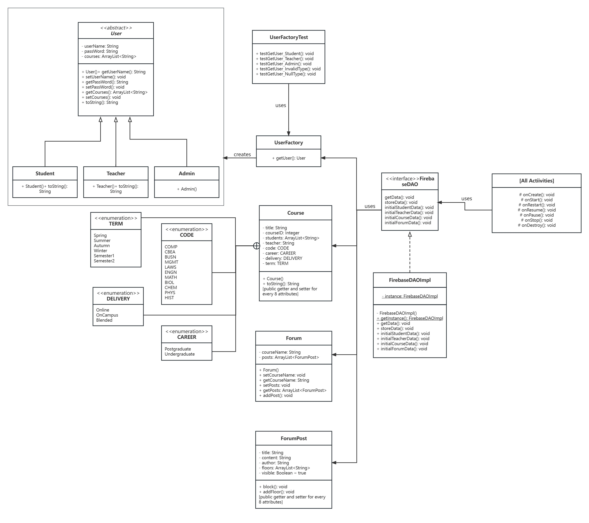

# [Group 3 - Echo361] Report

The following is a report template to help your team successfully provide all the details necessary for your report in a structured and organised manner. Please give a straightforward and concise report that best demonstrates your project. Note that a good report will give a better impression of your project to the reviewers.

## Table of Contents

1. [Team Members and Roles](#team-members-and-roles)
2. [Summary of Individual Contributions](#summary-of-individual-contributions)
3. [Conflict Resolution Protocol](#conflict-resolution-protocol)
4. [Application Description](#application-description)
5. [Application UML](#application-uml)
6. [Application Design and Decisions](#application-design-and-decisions)
7. [Summary of Known Errors and Bugs](#summary-of-known-errors-and-bugs)
8. [Testing Summary](#testing-summary)
9. [Implemented Features](#implemented-features)
10. [Team Meetings](#team-meetings)

## Team Members and Roles

| UID      |    Name     |                     Role |
|:---------|:-----------:|-------------------------:|
| u7564812 | Zetian Chen | Design Pattern, Database |
| u7528678 |  Zihan Ai   |              Forum, Chat |
| u7564899 | Yijun Huang |                UI, video |
| u7550484 |   Yuan Li   |      Tree Data Structure |
| u7504766 | Yitao Zhang |                   Search |

## Summary of Individual Contributions

**Code Implementation**

1. u7564812, Zetian Chen, I contribute 20% of the code. Here are my contributions:
   * [FirebaseDAO.class](https://gitlab.cecs.anu.edu.au/u7528678/ga-23s1-comp2100-6442/-/blob/main/app/src/main/java/com/example/echo361/Database/FirebaseDAO.java)
   * FirebaseDAOImpl.class: [getInstance()](https://gitlab.cecs.anu.edu.au/u7528678/ga-23s1-comp2100-6442/-/blob/main/app/src/main/java/com/example/echo361/Database/FirebaseDAOImpl.java#56-73), [storeData()](https://gitlab.cecs.anu.edu.au/u7528678/ga-23s1-comp2100-6442/-/blob/main/app/src/main/java/com/example/echo361/Database/FirebaseDAOImpl.java#186-195), [initialStudentData()](https://gitlab.cecs.anu.edu.au/u7528678/ga-23s1-comp2100-6442/-/blob/main/app/src/main/java/com/example/echo361/Database/FirebaseDAOImpl.java#203-222), [initialTeacherData()](https://gitlab.cecs.anu.edu.au/u7528678/ga-23s1-comp2100-6442/-/blob/main/app/src/main/java/com/example/echo361/Database/FirebaseDAOImpl.java#230-249), [initialForumData()](https://gitlab.cecs.anu.edu.au/u7528678/ga-23s1-comp2100-6442/-/blob/main/app/src/main/java/com/example/echo361/Database/FirebaseDAOImpl.java#460-479)
   * All classes in the [Factory folder](https://gitlab.cecs.anu.edu.au/u7528678/ga-23s1-comp2100-6442/-/tree/main/app/src/main/java/com/example/echo361/Factory)
   * All classes in the [FactoryTest folder](https://gitlab.cecs.anu.edu.au/u7528678/ga-23s1-comp2100-6442/-/tree/main/app/src/test/java/com/example/echo361/FactoryTest)
2. u7550484, Yuan Li, I contribute 20% of the code. Here are my contributions:
   * FirebaseDAOImpl.class: [getData()](https://gitlab.cecs.anu.edu.au/u7528678/ga-23s1-comp2100-6442/-/blob/main/app/src/main/java/com/example/echo361/Database/FirebaseDAOImpl.java#150-174), [storeData()](https://gitlab.cecs.anu.edu.au/u7528678/ga-23s1-comp2100-6442/-/blob/main/app/src/main/java/com/example/echo361/Database/FirebaseDAOImpl.java#186-195), [initialStudentData()](https://gitlab.cecs.anu.edu.au/u7528678/ga-23s1-comp2100-6442/-/blob/main/app/src/main/java/com/example/echo361/Database/FirebaseDAOImpl.java#203-222), [initialTeacherData()](https://gitlab.cecs.anu.edu.au/u7528678/ga-23s1-comp2100-6442/-/blob/main/app/src/main/java/com/example/echo361/Database/FirebaseDAOImpl.java#230-249), [initialCoursesData()](https://gitlab.cecs.anu.edu.au/u7528678/ga-23s1-comp2100-6442/-/blob/main/app/src/main/java/com/example/echo361/Database/FirebaseDAOImpl.java#263-452)
   * [CourseAVLtree.class](https://gitlab.cecs.anu.edu.au/u7528678/ga-23s1-comp2100-6442/-/blob/main/app/src/main/java/com/example/echo361/Search/CourseAVLtree.java)
   * All classes in the [CourseAVLTreeTest folder](https://gitlab.cecs.anu.edu.au/u7528678/ga-23s1-comp2100-6442/-/tree/main/app/src/test/java/com/example/echo361/CourseAVLTreeTest)
3. UID1, Name1, I contribute 20% of the code. Here are my contributions:
   * A.class
   * B.class: function1(), function2(), ...
4. UID1, Name1, I contribute 20% of the code. Here are my contributions:
   * A.class
   * B.class: function1(), function2(), ...
5. UID1, Name1, I contribute 20% of the code. Here are my contributions:
   * A.class
   * B.class: function1(), function2(), ...

**Code Design**

1. Design patterns (Factory, DAO, Singleton): u7564812, Zetian Chen
2. Data structures (AVL tree): u7550484, Yuan Li

**UI Design**
*[UI Design. Specify what design did the involved member propose? What tools were used for the design?]*

u7564899, Yijun Huang

**Report Writing**

| Report Part                         |                    Assignee                    |
|:------------------------------------|:----------------------------------------------:|
| Summary of Individual Contributions |                      All                       |
| Conflict Resolution Protocol        |             Zetian Chen (u7564812)             |
| Application Description             |             Yijun Huang (u7564899)             |
| Application UML                     | Zetian Chen (u7564812), Yitao Zhang (u7504766) |
| Application Design and Decisions    |                                                |
| 1. Data Structures                  |                      All                       |
| 2. Design Patterns                  |             Zetian Chen (u7564812)             |
| 3. Grammars & Tokenizer and Parsers |             Yitao Zhang (u7504766)             |
| Summary of Known Errors and Bugs    |             Yijun Huang (u7564899)             |
| Testing Summary                     |                      All                       |
| Implemented Features                |             Yijun Huang (u7564899)             |

**Slide preparation** 

u7564812, Zetian Chen

**Video preparation** 

u7564899, Yijun Huang

## Conflict Resolution Protocol

Our team used the following protocol to effectively handle conflicts:

1. Acknowledge the conflict: The team should acknowledge the conflict and its impact on the project. This should be done in a respectful and non-judgmental manner.
2. Identify the issue: The team should identify the underlying issue causing the conflict. This should be done in an objective manner, without any blame or personal attacks.
3. Listen to all viewpoints: All team members should have the opportunity to express their viewpoint. The team should actively listen to each other without interrupting or judging.
4. Collaborate to find a solution: The team should work together to find a solution that is acceptable to everyone. The solution should be based on the interests and needs of the team as a whole, not just individuals.
5. Implement the solution: Once a solution has been agreed upon, the team should implement it in a timely manner. The team should ensure that everyone understands their roles and responsibilities in implementing the solution.
6. Follow up: The team should follow up on the implemented solution to ensure that it is working effectively and that everyone is satisfied with it.
7. Document the conflict and solution: The team should document the conflict and the solution in writing. This documentation should include the issue, the solution, and the steps taken to implement the solution.

By following this protocol, our team has handled conflicts in a respectful and collaborative manner, leading to a better outcome for the project and team members.

## Application Description

*[What is your application, what does it do? Include photos or diagrams if necessary]*

*Here is a pet specific application example*

*PetBook is a social media application specifically targetting pet owners... it provides... certified practitioners, such as veterians are indicated by a label next to their profile...*

**Application Use Cases and or Examples**

*[Provide use cases and examples of people using your application. Who are the target users of your application? How do the users use your application?]*

*Here is a pet training application example*

*Molly wants to inquiry about her cat, McPurr's recent troublesome behaviour*
1. *Molly notices that McPurr has been hostile since...*
2. *She makes a post about... with the tag...*
3. *Lachlan, a vet, writes a reply to Molly's post...*
4. ...
5. *Molly gives Lachlan's reply a 'tick' response*

*Here is a map navigation application example*

*Targets Users: Drivers*

* *Users can use it to navigate in order to reach the destinations.*
* *Users can learn the traffic conditions*
* ...

*Target Users: Those who want to find some good restaurants*

* *Users can find nearby restaurants and the application can give recommendations*
* ...

*List all the use cases in text descriptions or create use case diagrams. Please refer to https://www.visual-paradigm.com/guide/uml-unified-modeling-language/what-is-use-case-diagram/ for use case diagram.*

## Application UML

  
*[Replace the above with a class diagram. You can look at how we have linked an image here as an example of how you can do it too.]*

## Application Design and Decisions

*Please give clear and concise descriptions for each subsections of this part. It would be better to list all the concrete items for each subsection and give no more than `5` concise, crucial reasons of your design. Here is an example for the subsection `Data Structures`:*

*I used the following data structures in my project:*

1. *LinkedList*

   * *Objective: It is used for storing xxxx for xxx feature.*

   * *Locations: line xxx in XXX.java, ..., etc.*

   * *Reasons:*

     * *It is more efficient than Arraylist for insertion with a time complexity O(1)*

     * *We don't need to access the item by index for this feature*

2. ...

3. ...

**Data Structures**

*[What data structures did your team utilise? Where and why?]*

we used 2 data Structures in our project:

1. *AVLtree*

    * *Objective: It is used for storing Courses for [Data-Deletion] feature ,[Search-Filter] feature and [Data Visualization].*
   
    * *Locations: line 70, 172 in AdminDeletionActivity.java, 
    * CourseAVLtree.java
    * FirebaseDAOImpl.java
    * , etc.*

   * *Reasons:*

   * *It is faster for searching with a time complexity O(log n)*

   * *It is balanced which ensures fast performance in various operations and avoids performance degradation caused by tree imbalance*

2. *ArrayList*

    * *Objective: It is used for storing Students and Teachers for [Data-Deletion] feature, [Search-Filter] feature and [Data Visualization].*

    * *Locations: line 84, 113 in AdminDeletionActivity.java,
    * FirebaseDAOImpl.java
    * , etc.*

    * *Reasons:*

    * *ArrayList stores elements in contiguous memory blocks, enabling efficient utilization of hardware caches and improving access efficiency.*

    * *It automatically adjusts its capacity based on the number of elements, allowing for efficient resizing as needed.*

    * *It is adapter for ListView component*

**Design Patterns**

We used 3 desgin patterns in our project:

**1. Factory**

The abstract class `User` has three subclasses, `Student class`, `Teacher class`, and `Admin class`. And the `UserFactory class` is responsible for creating instances of User subclasses based on the provided user type. It encapsulates the object creation logic and returns the appropriate User object. The method `getUser(String userType, String userName, String passWord, ArrayList<String> courses)` creates and returns a User object based on the specified user type, username, password, and courses.

Overall, the Factory design pattern was utilized in our Android project to encapsulate the object creation process, enhance flexibility, and promote code maintainability. It allowed us to abstract the creation logic from the client code, decoupling the object instantiation from the rest of the application and facilitating future modifications or extensions to the user creation process.

**2. DAO (Data Access Object)**

Our team utilized the DAO (Data Access Object) design pattern in our Android project. The DAO design pattern provides an abstraction layer between the application and the database, allowing for separation of concerns and easier maintenance.

In our implementation, we have two interfaces and one entity class as follows:

* `FirebaseDAO` interface:

   * getData(String refPath, String childPath, FirebaseDataCallback<T> callback): This method retrieves data from Firebase based on the reference and child paths provided and invokes the callback with the received data.

   * storeData(String refPath, String childPath, E input): This method stores data in Firebase based on the reference and child paths provided, along with the input data.

   * initialStudentData(Context context) throws IOException: This method initializes student data by reading it from a file and storing it in Firebase. It requires a Context object for file access.

   * initialTeacherData(Context context) throws IOException: This method initializes teacher data by reading it from a file and storing it in Firebase. It also requires a Context object.

   * initialCoursesData(Context context) throws IOException: This method initializes courses data by reading it from a file and storing it in Firebase. It requires a Context object as well.

   * initialForumData(Context context) throws IOException: This method initializes forum data by reading it from a file and storing it in Firebase. It also requires a Context object.

* `FirebaseDAOImpl` class: This class implements the FirebaseDAO interface and provides the actual implementation of the methods. It uses Singleton design pattern.

* `FirebaseDataCallback<T>` interface: This interface defines callback methods for handling data received from Firebase. It includes `onDataReceived(T data)` method, which is called when data is received successfully, and `onError(DatabaseError error)` method, which is called when there is an error retrieving data from Firebase.

We used the DAO design pattern in our project to encapsulate the logic for accessing and manipulating data in Firebase. It allows us to separate the data access code from the rest of the application and provides a clear and consistent interface for interacting with the database. By using this design pattern, we achieved better code organization, maintainability, and testability in our Android project.

**3. Singleton**

In addition to the DAO (Data Access Object) design pattern mentioned earlier, our team also utilized the Singleton design pattern in the `FirebaseDAOImpl` class of our Android project.

The Singleton design pattern ensures that only one instance of a class is created throughout the application's lifecycle. In our case, we applied the Singleton pattern to the `FirebaseDAOImpl` class to ensure that there is a single, globally accessible instance of the class for accessing the Firebase database.

By making `FirebaseDAOImpl` a Singleton, we can maintain a consistent connection to the Firebase database and avoid unnecessary resource consumption by reusing the same instance across different parts of the application. It also simplifies the codebase by providing a centralized point of access to Firebase-related functionality.

The Singleton design pattern is particularly useful in scenarios where we want to have a single instance of a class responsible for managing a shared resource or providing a global service. In the case of our `FirebaseDAOImpl` class, it ensures that we have a single instance responsible for handling data access to the Firebase backend, promoting efficiency and maintainability in our Android project.

**Grammar(s)**

Production Rules:
    
    <Non-Terminal> ::= <some output>
    <Non-Terminal> ::= <some output>

*[How do you design the grammar? What are the advantages of your designs?]*

*If there are several grammars, list them all under this section and what they relate to.*

**Tokenizer and Parsers**

*[Where do you use tokenisers and parsers? How are they built? What are the advantages of the designs?]*

**Surprise Item**

*[If you implement the surprise item, explain how your solution addresses the surprise task. What decisions do your team make in addressing the problem?]*

**Other**

*[What other design decisions have you made which you feel are relevant? Feel free to separate these into their own subheadings.]*

## Summary of Known Errors and Bugs

*[Where are the known errors and bugs? What consequences might they lead to?]*

*Here is an example:*

1. *Bug 1:*

- *Deleting courses from bottom to top in one searching round causes exceptions.*
- ...

2. *Bug 2:*

3. ...

*List all the known errors and bugs here. If we find bugs/errors that your team does not know of, it shows that your testing is not thorough.*

## Testing Summary

*[What features have you tested? What is your testing coverage?]*

*Here is an example:*

- *Number of test cases: ...*

- *Code coverage: ...*

- *Types of tests created: ...*

*Please provide some screenshots of your testing summary, showing the achieved testing coverage. Feel free to provide further details on your tests.*

## Implemented Features

*[What features have you implemented?]*

### Basic App
1. [Login] (easy) We use realtime database by Firebase to stock the user information.
     * Class MainActivity,
       Firebase link: https://console.firebase.google.com/project/echo361/overview
      * Additional description: There are three user roles: Student, Teacher and Admin.
        All the usernames and passwords can be seen in students.csv and teachers.csv from assets folder or Firebase.
        Admin login with special username “Ad Admin” and password “u0000000”.
       
2. [Data Instance] (easy) There are more than 3,000 valid data instances in our Firebase, which include user, course, forum and chat instances. 
3. [Data Visualization] (medium) Users are able to load data from Firebase and visualise it. We apply the AVLtree structure. When users use the app, they can see clear lists of courses and users to chat with.
    * Class CourseAVLtree  
4. [Search Information] (medium) Users are able to search for the class to enroll or drop, and the other user to chat with on our app.
    * Search folder,  Class SearchChatTarget,  Class EnrollActivity
        

### General Features
Feature Category: Firebase Integration  
Firebase link: https://console.firebase.google.com/project/echo361/overview  
1. [FB-Auth] (easy) Only the users stocked in our Firebase have authentication to the app. 
2. [FB-Persist] (medium) We use Firebase to persist all data used in your app. 
3. [FB-Syn] (hard) Any changes in Firebase will be applied immediately without restarting the app.

 

Feature Category: UI Design and Testing  
1. [UI-Layout] (easy) Our UI has reasonable portrait and landscape layout variants as well as support for different screen sizes. And as all data is stocked in Firebase, rotating the telephone at any time will not affect the existing data.
    * res folder
 

Feature Category: Search-related features  
1. [Search-Invalid] (medium) We have a tokenizer and parser with a formal grammar of our own creation so that search functionality can handle partially valid and invalid search queries. For example, if searching for punctuation marks like a comma, an invalid toast will show up. 
And if searching a chat target with only numbers, this is invalid too, as we set this to search letters like real names in reality (comp2100@anu.au is an exception). 
2. [Search-Filter] (easy) We implement the filter function so that students can use checkboxes to select from undergraduate, graduate, online, on-campus, and blended courses.
    * Search folder, Class SearchChatTarget, Class EnrollActivity
 

Feature Category: Privacy  
1. [Privacy-Visibility] (easy) A student can only see a course’s main page after enrolling in this course. 
2. [Privacy-Block] (medium) Teachers can block the forum, that is, change the visibility of this forum so that students cannot see it while teachers still can.
     * Class ForumTotalActivity
 

Feature Category: Peer-to-Peer Messaging  
1. [P2P-DM] (hard) Students and teachers have the ability to message the person involved in the same course in private.   
2. [P2P-Restriction] (hard) The chat function is assessed on the course main page of a certain course. By searching the chat target, users cannot search for students and teachers who are not involved in the same course to chat. 
Especially, students only need to type “teacher” to chat with the exact teacher who delivered this course.
     * Class Msg, MsgAdapter, ChatActivity, SearchChatTarget.

 

Feature Category: Greater Data Usage, Handling and Sophistication  
1. [Data-Deletion] (hard) We apply AVL tree data structure. Admin can delete a course with its teachers and enrolled students.
    * `CourseAVLtree` Class ,method: [delete()],Lines of 131-184
    * `AdAdminDeletionActivity` Class, method: [buttonDelete.setOnClickListener()], Lines of  55-141

## Team Meetings

- [Team Meeting 1](./meeting1.md)
- [Team Meeting 2](./meeting2.md)
- [Team Meeting 3](./meeting3.md)
- [Team Meeting 4](./meeting4.md)

* Link to the minutes of your meetings as above. There must be at least 4 team meetings. 
Note that you must commit your minute meetings shortly after your meeting has taken place (e.g., within 24h), otherwise your meeting minute will not be accepted.
Your meetings (and each member's commits) should also have a reasonable date span across Week 6 to 11.*
 
