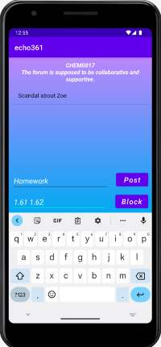
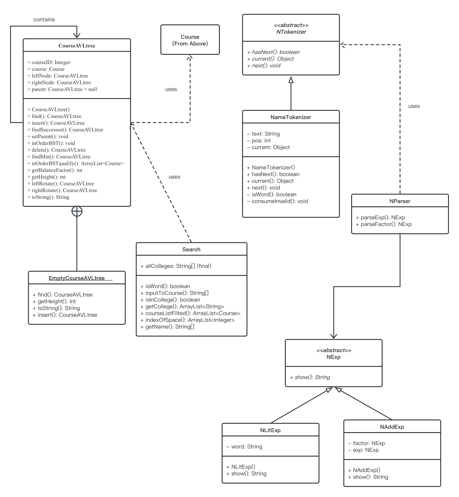
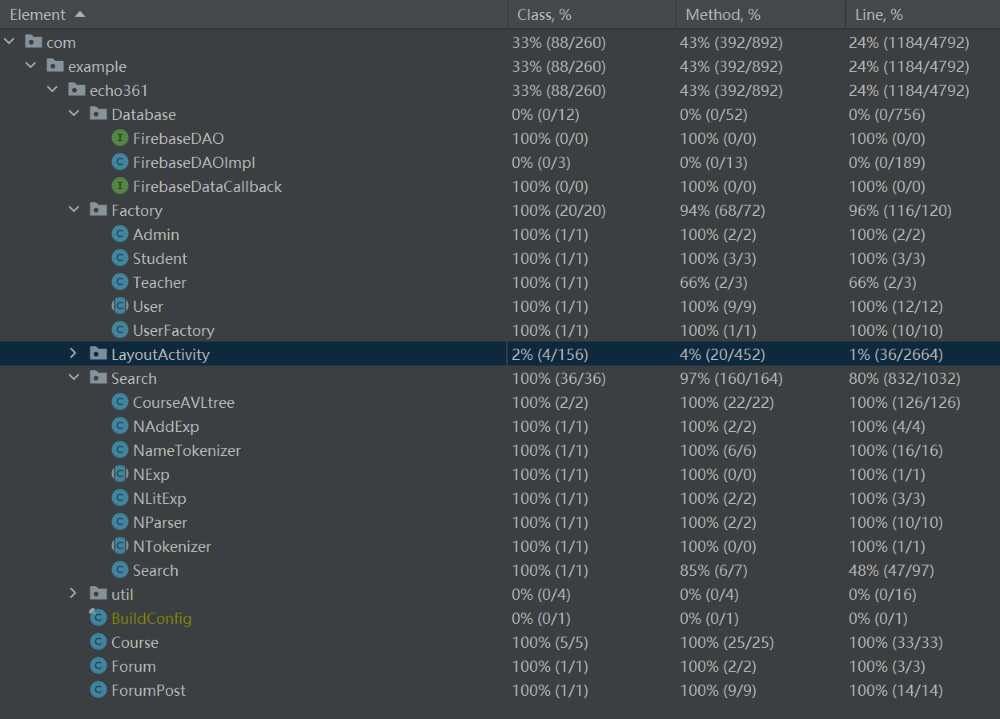

# [Group 3 - Echo361] Report

## Table of Contents

1. [Team Members and Roles](#team-members-and-roles)
2. [Summary of Individual Contributions](#summary-of-individual-contributions)
3. [Conflict Resolution Protocol](#conflict-resolution-protocol)
4. [Application Description](#application-description)
5. [Application UML](#application-uml)
6. [Application Design and Decisions](#application-design-and-decisions)
7. [Summary of Known Errors and Bugs](#summary-of-known-errors-and-bugs)
8. [Testing Summary](#testing-summary)
9. [Implemented Features](#implemented-features)
10. [Team Meetings](#team-meetings)

## Team Members and Roles

| UID      |    Name     |                     Role |
|:---------|:-----------:|-------------------------:|
| u7564812 | Zetian Chen | Design Pattern, Database |
| u7528678 |  Zihan Ai   |              Forum, Chat |
| u7564899 | Yijun Huang |   UI, App Testing, Video |
| u7550484 |   Yuan Li   |      Tree Data Structure |
| u7504766 | Yitao Zhang |                   Search |

## Summary of Individual Contributions

**Code Implementation**

1. u7564812, Zetian Chen, I contribute 20% of the code. Here are my contributions:
   * [FirebaseDAO.class](https://gitlab.cecs.anu.edu.au/u7528678/ga-23s1-comp2100-6442/-/blob/main/app/src/main/java/com/example/echo361/Database/FirebaseDAO.java)
   * FirebaseDAOImpl.class:
   [getInstance()](https://gitlab.cecs.anu.edu.au/u7528678/ga-23s1-comp2100-6442/-/blob/main/app/src/main/java/com/example/echo361/Database/FirebaseDAOImpl.java#56-73), 
   [storeData()](https://gitlab.cecs.anu.edu.au/u7528678/ga-23s1-comp2100-6442/-/blob/main/app/src/main/java/com/example/echo361/Database/FirebaseDAOImpl.java#186-195), 
   [initialStudentData()](https://gitlab.cecs.anu.edu.au/u7528678/ga-23s1-comp2100-6442/-/blob/main/app/src/main/java/com/example/echo361/Database/FirebaseDAOImpl.java#203-222), 
   [initialTeacherData()](https://gitlab.cecs.anu.edu.au/u7528678/ga-23s1-comp2100-6442/-/blob/main/app/src/main/java/com/example/echo361/Database/FirebaseDAOImpl.java#230-249), 
   [initialForumData()](https://gitlab.cecs.anu.edu.au/u7528678/ga-23s1-comp2100-6442/-/blob/main/app/src/main/java/com/example/echo361/Database/FirebaseDAOImpl.java#460-479)
   * All classes in the [Factory folder](https://gitlab.cecs.anu.edu.au/u7528678/ga-23s1-comp2100-6442/-/tree/main/app/src/main/java/com/example/echo361/Factory)
   * All classes in the [FactoryTest folder](https://gitlab.cecs.anu.edu.au/u7528678/ga-23s1-comp2100-6442/-/tree/main/app/src/test/java/com/example/echo361/FactoryTest)
2. u7550484, Yuan Li, I contribute 20% of the code. Here are my contributions:
   * FirebaseDAOImpl.class: [getData()](https://gitlab.cecs.anu.edu.au/u7528678/ga-23s1-comp2100-6442/-/blob/main/app/src/main/java/com/example/echo361/Database/FirebaseDAOImpl.java#150-174), [storeData()](https://gitlab.cecs.anu.edu.au/u7528678/ga-23s1-comp2100-6442/-/blob/main/app/src/main/java/com/example/echo361/Database/FirebaseDAOImpl.java#186-195), [initialStudentData()](https://gitlab.cecs.anu.edu.au/u7528678/ga-23s1-comp2100-6442/-/blob/main/app/src/main/java/com/example/echo361/Database/FirebaseDAOImpl.java#203-222), [initialTeacherData()](https://gitlab.cecs.anu.edu.au/u7528678/ga-23s1-comp2100-6442/-/blob/main/app/src/main/java/com/example/echo361/Database/FirebaseDAOImpl.java#230-249), [initialCoursesData()](https://gitlab.cecs.anu.edu.au/u7528678/ga-23s1-comp2100-6442/-/blob/main/app/src/main/java/com/example/echo361/Database/FirebaseDAOImpl.java#263-452)
   * [CourseAVLtree.class](https://gitlab.cecs.anu.edu.au/u7528678/ga-23s1-comp2100-6442/-/blob/main/app/src/main/java/com/example/echo361/Search/CourseAVLtree.java)
   * All classes in the [CourseAVLTreeTest folder](https://gitlab.cecs.anu.edu.au/u7528678/ga-23s1-comp2100-6442/-/tree/main/app/src/test/java/com/example/echo361/CourseAVLTreeTest)
3. U7504766, Yitao Zhang, I contribute 20% of the code. Here are my contributions:
   * [DropActivity.class](https://gitlab.cecs.anu.edu.au/u7528678/ga-23s1-comp2100-6442/-/blob/main/app/src/main/java/com/example/echo361/LayoutActivity/DropActivity.java)
   * [EnrollActivity.class](https://gitlab.cecs.anu.edu.au/u7528678/ga-23s1-comp2100-6442/-/blob/main/app/src/main/java/com/example/echo361/LayoutActivity/EnrollActivity.java)
   * [MyCourseActivity.class](https://gitlab.cecs.anu.edu.au/u7528678/ga-23s1-comp2100-6442/-/blob/main/app/src/main/java/com/example/echo361/LayoutActivity/MyCourseActivity.java#L52-96)
   * [SearchChatTarget.class](https://gitlab.cecs.anu.edu.au/u7528678/ga-23s1-comp2100-6442/-/blob/main/app/src/main/java/com/example/echo361/LayoutActivity/SearchChatTarget.java)
   * [NAddExp.class](https://gitlab.cecs.anu.edu.au/u7528678/ga-23s1-comp2100-6442/-/blob/main/app/src/main/java/com/example/echo361/Search/NAddExp.java)
   * [NExp.class](https://gitlab.cecs.anu.edu.au/u7528678/ga-23s1-comp2100-6442/-/blob/main/app/src/main/java/com/example/echo361/Search/NExp.java)
   * [NLitExp.class](https://gitlab.cecs.anu.edu.au/u7528678/ga-23s1-comp2100-6442/-/blob/main/app/src/main/java/com/example/echo361/Search/NLitExp.java)
   * [NParser.class](https://gitlab.cecs.anu.edu.au/u7528678/ga-23s1-comp2100-6442/-/blob/main/app/src/main/java/com/example/echo361/Search/NParser.java)
   * [NTokenizer.class](https://gitlab.cecs.anu.edu.au/u7528678/ga-23s1-comp2100-6442/-/blob/main/app/src/main/java/com/example/echo361/Search/NTokenizer.java)
   * [NameTokenizer.class](https://gitlab.cecs.anu.edu.au/u7528678/ga-23s1-comp2100-6442/-/blob/main/app/src/main/java/com/example/echo361/Search/NameTokenizer.java)
   * [Search.class](https://gitlab.cecs.anu.edu.au/u7528678/ga-23s1-comp2100-6442/-/blob/main/app/src/main/java/com/example/echo361/Search/Search.java)
   * All classes in the [Search folder under test](https://gitlab.cecs.anu.edu.au/u7528678/ga-23s1-comp2100-6442/-/tree/main/app/src/test/java/com/example/echo361/Search)
4. u7564899, Yijun Huang, I contribute 20% of the code. Here are my contributions:
   * [res folder](https://gitlab.cecs.anu.edu.au/u7528678/ga-23s1-comp2100-6442/-/tree/main/app/src/main/res)
   * [ToastUtil.class](https://gitlab.cecs.anu.edu.au/u7528678/ga-23s1-comp2100-6442/-/blob/main/app/src/main/java/com/example/echo361/util/ToastUtil.java)
   * [Msg.class](https://gitlab.cecs.anu.edu.au/u7528678/ga-23s1-comp2100-6442/-/blob/main/app/src/main/java/com/example/echo361/LayoutActivity/Msg.java)
   * [MsgAdapter.class](https://gitlab.cecs.anu.edu.au/u7528678/ga-23s1-comp2100-6442/-/blob/main/app/src/main/java/com/example/echo361/LayoutActivity/MsgAdapter.java)
5. U7528678, Zihan Ai, I contribute 20% of the code. Here are my contributions:
   * [Forum.class](https://gitlab.cecs.anu.edu.au/u7528678/ga-23s1-comp2100-6442/-/blob/main/app/src/main/java/com/example/echo361/Forum.java)
   * [ForumPost.class](https://gitlab.cecs.anu.edu.au/u7528678/ga-23s1-comp2100-6442/-/blob/main/app/src/main/java/com/example/echo361/ForumPost.java)
   * [ChatActivity](https://gitlab.cecs.anu.edu.au/u7528678/ga-23s1-comp2100-6442/-/blob/main/app/src/main/java/com/example/echo361/LayoutActivity/ChatActivity.java)
   * [ForumTotalActivity](https://gitlab.cecs.anu.edu.au/u7528678/ga-23s1-comp2100-6442/-/blob/main/app/src/main/java/com/example/echo361/LayoutActivity/ForumTotalActivity.java)
   * [ForumDetailActivity](https://gitlab.cecs.anu.edu.au/u7528678/ga-23s1-comp2100-6442/-/blob/main/app/src/main/java/com/example/echo361/LayoutActivity/ForumDetailActivity.java)
   * All class in the [utilsTest folder under test](https://gitlab.cecs.anu.edu.au/u7528678/ga-23s1-comp2100-6442/-/tree/main/app/src/test/java/com/example/echo361/utilsTest)

**Code Design**

1. Design patterns (Factory, DAO, Singleton): u7564812, Zetian Chen
2. Data structures (AVL tree): u7550484, Yuan Li

**UI Design**

u7564899, Yijun Huang

1. UI theme. I set the app theme with gradient background from cool purple and neutral blue to make it elegant. With strong contrast, the text color are set white so that users can clearly read.
2. UI design for different user roles. Our group brought out the initial idea that the target users of echo361 are students and teachers, with an admin account to control the courses. 
   * Students. The students main page leads them to different page so that they can enroll courses, drop courses, and go to all current courses page. When enrolling courses, checkboxes are applied to implement the Search-Filter feature. Furthermore, in each course's main page, students can go to forums or chat with the ones involved in the same courses.
   * Teachers. We simply set that one teacher only teaches one course, so they directly go to the course's main page like what students see. The main different between their pages are that in the forum total page, there is a Block button whose visibility varies from students and teachers. By this button, teachers can control the forums' visibility (Privacy-Block feature).
   * Admin. The admin deletion page enables admin to search and delete courses with involved students and teachers.
3. Toast. I find a reference to write the [ToastUtil.class](https://gitlab.cecs.anu.edu.au/u7528678/ga-23s1-comp2100-6442/-/blob/main/app/src/main/java/com/example/echo361/util/ToastUtil.java)  so that my teammates can simply write toasts without redundant codes to give some information to users. Also, a little bug leading us to find solutions for a long time was simply solved by changing the toast length, which is somewhat fun.
4. Dialog box by .9.png format. It is difficult to only use our basic knowledge to write a great chat page which shows like that in reality that the received messages are aligned to the left, and the send messages are aligned to the right. Luckily, I also find some reference and successfully solved it. 

**Report Writing**

| Report Part                         |                                Assignee                                |
|:------------------------------------|:----------------------------------------------------------------------:|
| Summary of Individual Contributions |                                  All                                   |
| Conflict Resolution Protocol        |                         Zetian Chen (u7564812)                         |
| Application Description             |                           Yuan Li (u7550484)                           |
| Application UML                     |             Zetian Chen (u7564812), Yitao Zhang (u7504766)             |
| Application Design and Decisions    |                                                                        |
| 1. Data Structures                  |               Yuan Li (u7550484), Yitao Zhang (u7504766)               |
| 2. Design Patterns                  |                         Zetian Chen (u7564812)                         |
| 3. Grammars & Tokenizer and Parsers |                         Yitao Zhang (u7504766)                         |
| Summary of Known Errors and Bugs    |                         Yijun Huang (u7564899)                         |
| Testing Summary                     |                          Zihan Ai (u7528678)                           |
| Implemented Features                | Yijun Huang (u7564899), Zetian Chen (u7564812), Yitao Zhang (u7504766) |

**Slide preparation** 

u7564812, Zetian Chen

**Video preparation** 

u7564899, Yijun Huang

## Conflict Resolution Protocol

Our team used the following protocol to effectively handle conflicts:

1. Acknowledge the conflict: The team should acknowledge the conflict and its impact on the project. This should be done in a respectful and non-judgmental manner.
2. Identify the issue: The team should identify the underlying issue causing the conflict. This should be done in an objective manner, without any blame or personal attacks.
3. Listen to all viewpoints: All team members should have the opportunity to express their viewpoint. The team should actively listen to each other without interrupting or judging.
4. Collaborate to find a solution: The team should work together to find a solution that is acceptable to everyone. The solution should be based on the interests and needs of the team as a whole, not just individuals.
5. Implement the solution: Once a solution has been agreed upon, the team should implement it in a timely manner. The team should ensure that everyone understands their roles and responsibilities in implementing the solution.
6. Follow up: The team should follow up on the implemented solution to ensure that it is working effectively and that everyone is satisfied with it.
7. Document the conflict and solution: The team should document the conflict and the solution in writing. This documentation should include the issue, the solution, and the steps taken to implement the solution.

By following this protocol, our team has handled conflicts in a respectful and collaborative manner, leading to a better outcome for the project and team members.

## Application Description

Echo361 is an educational software designed for teachers and students to engage in online discussions.
It provides various features where students can enroll and drop courses, post in the forums of their respective courses, or chat with other people in the same course. 
Teachers can engage in private conversations with students, post in forums, and manage discussions. The admin is responsible for course administration. 

Target users: Teachers, Students and an Admin

**Application Use Cases and or Examples**

Use case 1: Rylie Brown wants to enroll in CHEM0309
1. Rylie Brown logs in
2. Rylie Brown searches for CHEM0309 and enrolls it 
 

Use case 2: Rylie Brown wants to have a chat with Bella Cave about BUSN0146
1. Rylie Brown logged in
2. Rylie Brown and Bella Cave are classmates of BUSN0146 
 
3. Rylie Brown finded her and sends a hi to her
4. Bella Cave told Rylie Brown there is a huge workload in BUSN0146
5Then Rylie Brown dropped BUSN0146

Use case 3: Aubree Smith(teacher) wants to post something in the forum

1. Aubree Smith logged in and go to his course page
2. He saw the first post in the forum and decide to block it
3. Then he posted some homeworks. 
 

Use case 4: Admin wants to delete COMP0010

1. The teacher of COMP0010 is going to retire. So there will be no teacher for COMP0010 next semester.
2. Admin logged in
3. He finded COMP0010 and delete it. 
 

## Application UML

  
  

## Application Design and Decisions

**Data Structures**

we used the following data Structures in our project:

1. AVLtree

   * Objective: It is used for storing Courses for [Data-Deletion] feature ,[Search-Filter] feature, [Data Visualization] and [P2P-Restriction] feature.

   * Locations: CourseAVLtree.java
    * Line 70, 172 in AdminDeletionActivity.java, 
    * Line 269-279 in FirebaseDAOImpl.java
    * Line 122 in DropActivity.java
    * Line 129, 194 in EnrollActivity.java
    * Line 108 in SearchChatTarget.java
    * Line 109-196 in Search.java

   * Reasons:

     * It is faster for searching with a time complexity O(log n).
     * It is balanced which ensures fast performance in various operations and avoids performance degradation caused by tree imbalance.

2. ArrayList

   * Objective: It is used for storing Students and Teachers for [Data-Deletion] feature, [Search-Filter] feature, [Data Visualization] and [P2P-Restriction] feature.

    * Locations: 
    * Line 84, 113 in AdminDeletionActivity.java,
    *  Line 208, 212, 235, 239, 286 in FirebaseDAOImpl.java
    *  Line 13, 28, 70, 78 in User.java
    *  Line 21 in UserFactory.java
    *  Line 65, 83, 121, 128 in DropActivity.java
    *  Line 98, 113, 128, 193, 200, 224 in EnrollActivity.java
    * Line 56, 77 in MyCourseActivity.java
    * Line 107, 114, 117, 124 in SearchChatTarget.java
    *  Line 83, 111-180, 189, 211 in Search.java

   * Reasons:

    * ArrayList stores elements in contiguous memory blocks, enabling efficient utilization of hardware caches and improving access efficiency.
    * It automatically adjusts its capacity based on the number of elements, allowing for efficient resizing as needed.
    * It is adapter for ListView component.

**Design Patterns**

We used 3 desgin patterns in our project:

1. Factory

    The abstract class `User` has three subclasses, `Student class`, `Teacher class`, and `Admin class`. And the `UserFactory class` is responsible for creating instances of User subclasses based on the provided user type. It encapsulates the object creation logic and returns the appropriate User object. The method `getUser(String userType, String userName, String passWord, ArrayList<String> courses)` creates and returns a User object based on the specified user type, username, password, and courses.

    Overall, the Factory design pattern was utilized in our Android project to encapsulate the object creation process, enhance flexibility, and promote code maintainability. It allowed us to abstract the creation logic from the client code, decoupling the object instantiation from the rest of the application and facilitating future modifications or extensions to the user creation process.

2. DAO (Data Access Object)

    Our team utilized the DAO (Data Access Object) design pattern in our Android project. The DAO design pattern provides an abstraction layer between the application and the database, allowing for separation of concerns and easier maintenance.

    In our implementation, we have two interfaces and one entity class as follows:

    * `FirebaseDAO` interface:

      * `getData(String refPath, String childPath, FirebaseDataCallback<T> callback)`: This method retrieves data from Firebase based on the reference and child paths provided and invokes the callback with the received data.
      * `storeData(String refPath, String childPath, E input)`: This method stores data in Firebase based on the reference and child paths provided, along with the input data.
      * `initialStudentData(Context context) throws IOException`: This method initializes student data by reading it from a file and storing it in Firebase. It requires a Context object for file access.
      * `initialTeacherData(Context context) throws IOException`: This method initializes teacher data by reading it from a file and storing it in Firebase. It also requires a Context object.
      * `initialCoursesData(Context context) throws IOException`: This method initializes courses data by reading it from a file and storing it in Firebase. It requires a Context object as well.
      * `initialForumData(Context context) throws IOException`: This method initializes forum data by reading it from a file and storing it in Firebase. It also requires a Context object.

    * `FirebaseDAOImpl` class: This class implements the FirebaseDAO interface and provides the actual implementation of the methods. It uses Singleton design pattern.

    * `FirebaseDataCallback<T>` interface: This interface defines callback methods for handling data received from Firebase. It includes `onDataReceived(T data)` method, which is called when data is received successfully, and `onError(DatabaseError error)` method, which is called when there is an error retrieving data from Firebase.

    We used the DAO design pattern in our project to encapsulate the logic for accessing and manipulating data in Firebase. It allows us to separate the data access code from the rest of the application and provides a clear and consistent interface for interacting with the database. By using this design pattern, we achieved better code organization, maintainability, and testability in our Android project.

3. Singleton

    In addition to the DAO (Data Access Object) design pattern mentioned earlier, our team also utilized the Singleton design pattern in the `FirebaseDAOImpl` class of our Android project.

    The Singleton design pattern ensures that only one instance of a class is created throughout the application's lifecycle. In our case, we applied the Singleton pattern to the `FirebaseDAOImpl` class to ensure that there is a single, globally accessible instance of the class for accessing the Firebase database.

    By making `FirebaseDAOImpl` a Singleton, we can maintain a consistent connection to the Firebase database and avoid unnecessary resource consumption by reusing the same instance across different parts of the application. It also simplifies the codebase by providing a centralized point of access to Firebase-related functionality.

    The Singleton design pattern is particularly useful in scenarios where we want to have a single instance of a class responsible for managing a shared resource or providing a global service. In the case of our `FirebaseDAOImpl` class, it ensures that we have a single instance responsible for handling data access to the Firebase backend, promoting efficiency and maintainability in our Android project.

**Grammar(s)**

Production Rules:
    
    <exp> ::= <factor> | <factor> <exp>
    <factor> ::= <token>

   This Grammar is designed to allow the search for a student's name to be converted into tokens and then sorted in order of input. This helps us to distinguish between first name and last name. Tokenizer and Parser will help us to put all consecutive letters together as one word, and to use all non-letter symbols as separators. When searching by student name, although when we enter only one word we can only treat it as a student's first name to search, when we search for a student by last name and first name, we treat the first token as the first name and the last token as the last name and find all students whose first and last names contain the information entered in the search. This provides more accurate search results while enabling partial searches.

**Tokenizer and Parsers**

   The `NameTokenizer` class is an implementation of the `NTokenizer` abstract class for splitting a given input text as words, removing all non-letter symbols from it and treating these non-letter symbols as spacers, with the word being defined as sequences of consecutive letters.

   The `NParser` class arranges the tokens by input order using the `NAddExp` and `NLitExp` to implement the Grammar above and adds a separator, a space, between each token. This makes it easier to identify the first name and last name of the input. When searching by student name, although when we enter only one word we can only treat it as a student's first name to search, when we search for a student by last name and first name, we treat the first token as the first name and the last token as the last name, and find all students whose first and last names contain the information entered by searching. This provides more accurate search results while enabling partial searches.

## Summary of Known Errors and Bugs

1. When searching for a student to chat with, the search function does not support searching for pure numbers. For example, you cannot search "2" or "2100" for the given account (comp2100@anu.au), because we assume that names are made up of letters only and that other symbols such as numbers, punctuations, etc. will be ignored. Alternatively, you can search "comp" or "comp2100" or "com" etc. for this account. 
2. Admin can get a search result of all the courses by typing symbols casually, as a shortcut for admin account. On the contrary, this kind of typing is regarded as invalid input for students and teachers account.

## Testing Summary

* courseAVLTreeTest:
- * Number of test cases: 18
- * Code coverage: Class: 100%, Method: 100%, Line: 100%
- * Types of tests created: AVLTree insertion, deletion, null check, find specific node.

* courseTest:
- * Number of test cases: 1
- * Code coverage: Class: 100%, Method: 68%, Line: 75%
- * Types of tests created: add course, setters and getters tests.

* AdminTest:
- * Number of test cases: 3
- * Code coverage: Class: 100%, Method: 100%, Line: 100%
- * Types of tests created: initialization, setter, toString method.

* StudentTest:
- * Number of test cases: 3
- * Code coverage: Class: 100%, Method: 66%, Line: 66%
- * Types of tests created: initialization, setter, toString method.

* TeacherTest:
- * Number of test cases: 2
- * Code coverage: Class: 100%, Method: 66%, Line: 66%
- * Types of tests created: initialization, toString method.

* UserFactoryTest:
- * Number of test cases: 5
- * Code coverage: Class: 100%, Method: 66%, Line: 66%
- * Types of tests created: setters and getters, null check.

* UserTest:
- * Number of test cases: 3
- * Code coverage: Class: 100%, Method: 100%, Line: 100%
- * Types of tests created: initialization, setter, toString method.

* NtokenizerTest:
- * Number of test cases: 3
- * Code coverage: Class: 100%, Method: 100%, Line: 100%
- * Types of tests created: tokenizing.

* ParserTest:
- * Number of test cases: 8
- * Code coverage: Class: 100%, Method: 100%, Line: 100%
- * Types of tests created: Parsing.

* SearchTest:
- * Number of test cases: 6
- * Code coverage: Class: 100%, Method: 85%, Line: 48%
- * Types of tests created: course name test, name test, word test, college name test, validation test.

* ForumTest:
- * Number of test cases: 5
- * Code coverage: Class: 100%, Method: 100%, Line: 100%
- * Types of tests created: tests about Forum constructor.

* ForumPostTest:
- * Number of test cases: 10
- * Code coverage: Class: 100%, Method: 100%, Line: 100%
- * Types of tests created: tests about ForumPost constructor.

* MsgTest:
- * Number of test cases: 6
- * Code coverage: Class: 100%, Method: 83%, Line: 90%
- * Types of tests created: tests about Msg constructor.

## Implemented Features

### Basic App
1. [Login] (easy) We use realtime database by Firebase to stock the user information.
   * Class MainActivity, lines of code: whole file  
   * Firebase link: https://console.firebase.google.com/project/echo361/overview
   * Additional description: There are three user roles: Student, Teacher and Admin. All the usernames and passwords can be seen in students.csv and teachers.csv from assets folder or Firebase. Admin login with special username “Ad Admin” and password “u0000000”.

2. [Data Instance] (easy) There are more than 3,000 valid data instances in our Firebase, which include user, course, forum and chat instances.

3. [Data Visualization] (medium) Application are able to load data from Firebase and visualise it. When users use the app, they can see clear lists of courses, posts in the forum, users to chat with, and the contents of peer to peer messaging.
   * Class AdminDeletionActivity(search courses then visualize), lines of code: 146-183
   * Class DropActivity(get courses then visualize), lines of code: 60-97
   * Class EnrollActivity(search courses then visualize), lines of code: 84-140
   * Class MyCourseActivity(get courses then visualize), lines of code: 52-74
   * Class SearchChatTarget(search students then visualize), lines of code: 74-150, 172-195
   * Class ForumDetailActivity, ForumTotalActivity (users forum fuction visualise), lines of code: whole file
   * Class ChatActivity, Msg, MsgAdapter (users chat function visualize), lines of code: whole file

4. [Search Information] (medium) Users are able to search for/get the class to enroll or delete and the other users to chat with on our app.
   * Class AdminDeletionActivity(search courses), lines of code: 146-181
   * Class DropActivity(get courses), lines of code: 60-76
   * Class EnrollActivity(search courses), lines of code: 84-136
   * Class MyCourseActivity(get courses), lines of code: 52-70
   * Class SearchChatTarget(search students), lines of code: 74-145, 167-191
   * All classes in the Search folder(Tokenizer, Parser, and methods used for searching), lines of code: whole file
     

### General Features
**Feature Category: Firebase Integration**

Firebase link: https://console.firebase.google.com/project/echo361/overview  

1. [FB-Auth] (easy) Only the users stocked in our Firebase have authentication to the app.
   * Class MainActivity, FirebaseDAO, FirebaseDAOImpl, FirebaseDataCallback, lines of code: whole file
   * Additional description: MainActivity class implements the log in function, which reads the user data from Firebase.

2. [FB-Persist] (medium) We use Firebase to persist all data used in our app.
   * Class MainActivity, lines of code: 53-61
   * Class FirebaseDAOImpl, method initialStudentData, initialTeacherData, initialCourseData, initialForumData, lines of code: 203-479
   * Additional description: The data initialisation is performed only once, which is to convert the files (students.csv, teachers.csv, courses.scv) in the asset folder into the correct data structure and store them in the Firebase, so these code in the MainActivity class is commented now.
   
3. [FB-Syn] (hard) Any changes in Firebase will be applied immediately without restarting the app.
   * Class ForumTotalActivity, lines of code: 62-181
   * Class ForumDetailActivity, lines of code: 53-73
   * class ChatActivity, lines of code: 75-133
   * class EnrollActivity, lines of code: 122-151
   * class DropActivity, lines of code: 62-91
   * Additional description: The "onDataReceived" function is a function that gets called after data has been downloaded from Firebase.

**Feature Category: UI Design and Testing** 

1. [UI-Layout] (easy) Our UI has reasonable portrait and landscape layout variants as well as support for different screen sizes. And as all data is stocked in Firebase, rotating the telephone at any time will not affect the existing data.
   * res folder

**Feature Category: Search-related features** 

1. [Search-Invalid] (medium) When we search by a name of student, we have a tokenizer and parser with a formal grammar of our own creation so that search functionality can handle partially valid and invalid search queries. For example, if searching for punctuation marks like a comma, an invalid toast will show up. 
And if searching a chat target with only numbers, this is invalid too, as we set this to search letters like real names in reality (comp2100@anu.au is an exception).
When we search for courses, we use the first four letters as the college code and the first four digits as the corses code by checking each character entered, using the college code and corses code to achieve a precise search. If less than four letters or numbers are entered, the letters will be treated as the college code and the numbers as the courses code, displaying the course information for all courses that contain the information entered.
   * Class AdminDeletionActivity(to search courses), lines of code: 155-161 
   * Class EnrollActivity(to search courses), lines of code: 93-108
   * Class Search, method getCollege(), lines of code:
   * Class SearchChatTarget(to search students), lines of code: 78-90
   * Class NameTokenizer, lines of code: whole file
   * class NParser, lines of code: whole file

2. [Search-Filter] (easy) We implement the filter function so that students can use checkboxes to select from undergraduate, graduate, online, on-campus, and blended courses.
   * Class Search, method courseListFilted(), lines of code: 109-180

**Feature Category: Privacy** 

1. [Privacy-Visibility] (easy) A student can only see a course’s main page after enrolling in this course.
   * Additional description: this is implement with combination of UI design, data structure and Firebase.

2. [Privacy-Block] (medium) Teachers can block the forum, that is, change the visibility of this forum so that students cannot see it while teachers still can.
   * Class ForumTotalActivity, lines of code: 114-123, 168-178
   * Additional description: To activate the block function, first click Block button then choose the forum to change its visibility.

**Feature Category: Peer-to-Peer Messaging** 

1. [P2P-DM] (hard) Students and teachers have the ability to message the person involved in the same course in private.  
   * Class Chat Activity, Msg, MsgAdapter, lines of code: whole file

2. [P2P-Restriction] (hard) The chat function is assessed on the course main page of a certain course. By searching the chat target, users cannot search for students and teachers who are not involved in the same course to chat. 
Especially, students only need to type “teacher” to chat with the exact teacher who delivered this course.
   * Class SearchChatTarget, lines of code: 121, 137-139, 167-181

**Feature Category: Greater Data Usage, Handling and Sophistication** 

1. [Data-Deletion] (hard) We apply AVL tree data structure. Admin can delete a course with its teachers and enrolled students.
   * Class CourseAVLtree: method delete(), lines of code: 131-184
   * Class AdminDeletionActivity: method buttonDelete.setOnClickListener(), lines of code 51-145

## Team Meetings

- [Team Meeting 1](./meeting1.md)
- [Team Meeting 2](./meeting2.md)
- [Team Meeting 3](./meeting3.md)
- [Team Meeting 4](./meeting4.md)

 
